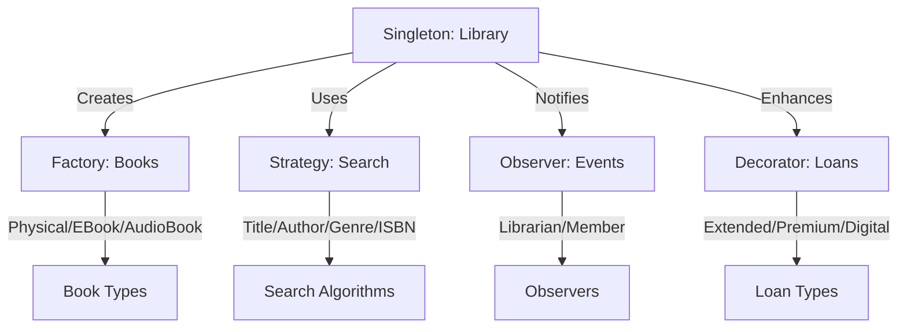

<div align="center">

# 🏗️ Architecture and System Design Lab

### Enterprise-Grade Software Architecture & Design Patterns

[](https://spring.boot.io/)
[](https://nodejs.org/)
[](https://www.oracle.com/java/)
[](https://www.mongodb.com/)
[](https://redis.io/)
[](https://www.rabbitmq.com/)
[](https://www.docker.com/)

[🇻🇳 Tiếng Việt](README.vi.md) | [📂 Lab Materials](https://drive.google.com/drive/folders/18mLTR-UwUL_YvTdszfGPefyAqfLE3SYK) | [📖 Documentation](#-documentation)

---

</div>

## 📖 Overview

This repository contains **practical lab assignments** for the **Architecture and System Design (ASD)** course, focusing on building scalable, maintainable, and high-performance software systems using industry-standard patterns, principles, and best practices.

### 🎯 Learning Objectives

<table>
<tr>
<td width="50%">

**Architecture & Design**
- ✨ Master Gang of Four (GoF) Design Patterns
- 🏛️ Implement Clean Architecture principles
- 📐 Apply SOLID design principles
- 🔄 Design Microservices Architecture

</td>
<td width="50%">

**Performance & Scalability**
- ⚡ Optimize system performance (24x improvement)
- 🗄️ Database indexing & query optimization
- 💾 Implement caching strategies (Redis)
- 📨 Asynchronous processing with Message Queues

</td>
</tr>
</table>

---

## 📚 Course Content

<details open>
<summary><b>Week 01 - Microservices Fundamentals</b></summary>

### 🔐 JWT Authentication Service

<table>
<tr><td width="30%"><b>Technology</b></td><td>Node.js, Express.js, JWT, bcrypt</td></tr>
<tr><td><b>Concepts</b></td><td>Token-based authentication, Middleware, Security</td></tr>
<tr><td><b>Features</b></td><td>
  
- User registration with password hashing
- Secure login with JWT token generation
- Protected routes with auth middleware
- Token refresh mechanism
- Session management

</td></tr>
</table>

### 📨 Message Queue with RabbitMQ

<table>
<tr><td width="30%"><b>Technology</b></td><td>RabbitMQ, amqplib, Docker Compose</td></tr>
<tr><td><b>Patterns</b></td><td>Work Queues, Publish/Subscribe, Topic Exchange</td></tr>
<tr><td><b>Use Cases</b></td><td>
  
- Asynchronous task processing
- Event-driven architecture
- Service decoupling
- Load distribution

</td></tr>
</table>

**[📁 View Week 01 Details](week01/)**

</details>

<details open>
<summary><b>Week 02 - Performance Optimization</b></summary>

### ⚡ eCommerce Performance Tuning

<div align="center">

| Metric | Before | After | Improvement |
|:------:|:------:|:-----:|:-----------:|
| **Response Time** | 170ms | 7ms | **24x faster** |
| **Throughput** | ~60 req/s | ~1,400 req/s | **23x increase** |
| **Performance** | Baseline | Optimized | **95.9% faster** |

</div>

### 🛠️ Optimization Techniques

<table>
<tr>
<td width="33%" valign="top">

**Database Layer**
- MongoDB indexing (single & compound)
- Query optimization (`.lean()`)
- Connection pooling
- Field projection
- Aggregation pipeline

</td>
<td width="33%" valign="top">

**Caching Layer**
- Redis implementation
- Cache-aside pattern
- TTL management (60s)
- Cache invalidation
- Hit/miss tracking

</td>
<td width="33%" valign="top">

**API Design**
- `/slow` - Load all + filter
- `/fast` - Query + cache
- Response comparison
- Performance metrics
- Postman test collection

</td>
</tr>
</table>

**Tech Stack:** Node.js, Express, MongoDB, Redis, Docker, Autocannon

**[📁 View Week 02 Details](week02/ecommerce-mini/)**

</details>

<details open>
<summary><b>Week 03 - Design Patterns Implementation</b></summary>

### 🎨 7 Essential GoF Patterns

<table>
<tr>
<td width="33%" valign="top">

**Structural Patterns**
- 🌳 **Composite**
  - File System hierarchy
  - UI Component trees
- 🔌 **Adapter**
  - XML ↔ JSON conversion
  - Legacy system integration
- 🎁 **Decorator**
  - Loan enhancements
  - Feature stacking

</td>
<td width="33%" valign="top">

**Behavioral Patterns**
- 👁️ **Observer**
  - Stock market notifications
  - Task management events
- 🔀 **Strategy**
  - Search algorithms
  - Runtime switching
  - Interchangeable behaviors

</td>
<td width="33%" valign="top">

**Creational Patterns**
- 🔒 **Singleton**
  - Library instance
  - Global access point
- 🏭 **Factory Method**
  - Book creation
  - Physical/EBook/AudioBook
  - Polymorphic objects

</td>
</tr>
</table>

### 📚 Library Management System

**Integrated Pattern Architecture:**



### 🌐 Live API Demos

<table>
<tr>
<td width="50%">

**Pattern Demonstrations**
- [`/api/composite/demo`](http://localhost:8080/api/composite/demo)
- [`/api/observer/demo`](http://localhost:8080/api/observer/demo)
- [`/api/adapter/demo`](http://localhost:8080/api/adapter/demo)

</td>
<td width="50%">

**Integrated System**
- [`/api/library/demo`](http://localhost:8080/api/library/demo)
- Complete pattern integration
- Real-world use cases

</td>
</tr>
</table>

**Tech Stack:** Spring Boot 3.2.1, Java 17, Maven, Lombok, Jackson

**[📁 View Week 03 Details](week03/ex1/)**

</details>

---

## 🛠️ Technology Stack

<table>
<tr>
<td width="50%" valign="top">

### Backend Frameworks


- **Spring Boot 3.2.1** (Java 17) - Enterprise patterns
- **Express.js 4.18** (Node.js 18+) - Microservices

### Databases & Cache


- **MongoDB 7.0** - Document database
- **Redis 7.0** - In-memory data store

### Message Broker


- **RabbitMQ 3.12** - AMQP message broker

</td>
<td width="50%" valign="top">

### DevOps & Tools


- **Docker 24.0** - Containerization platform
- **Maven 3.6+** - Java build automation
- **npm/npx** - Node.js package management

### Languages


- **Java 17** - LTS version for Spring Boot
- **JavaScript ES6+** - Modern Node.js features

</td>
</tr>
</table>

---

## 🚀 Quick Start

### 🔐 Week 01 - Microservices

<details>
<summary>Click to expand setup instructions</summary>

**JWT Authentication:**
```bash
cd week01/jwt-auth
npm install
npm start
# Server running on http://localhost:3000
```

**Message Queue:**
```bash
cd week01/message-queue
docker-compose up -d      # Start RabbitMQ
npm install
npm run producer          # Terminal 1
npm run consumer          # Terminal 2
```

</details>

### ⚡ Week 02 - Performance Optimization

<details>
<summary>Click to expand setup instructions</summary>

```bash
cd week02/ecommerce-mini

# Start infrastructure
docker-compose up -d      # MongoDB + Redis

# Setup application
npm install
npm run seed             # Seed 10,000 products

# Run server
npm start               # http://localhost:3000

# Test performance
npm run test:performance
```

**API Endpoints:**
- `GET /api/products/slow` - Unoptimized (170ms)
- `GET /api/products/fast` - Optimized (7ms)
- `DELETE /api/cache/clear` - Clear Redis cache

</details>

### 🎨 Week 03 - Design Patterns

<details>
<summary>Click to expand setup instructions</summary>

```bash
cd week03/ex1

# Build and run
mvn clean install
mvn spring-boot:run

# Or run in IDE
# Open DesignPatternsApplication.java
# Run as Spring Boot App
```

**Access Demos:**
- 🏠 Home: http://localhost:8080
- 🌳 Composite: http://localhost:8080/api/composite/demo
- 👁️ Observer: http://localhost:8080/api/observer/demo
- 🔌 Adapter: http://localhost:8080/api/adapter/demo
- 📚 Library: http://localhost:8080/api/library/demo

</details>

---

## 📚 Documentation & Resources

### 📂 Lab Materials

<div align="center">

**[📥 Download Lab Materials](https://drive.google.com/drive/folders/18mLTR-UwUL_YvTdszfGPefyAqfLE3SYK)**

*Lecture slides, assignments, references, templates & examples*

</div>

### 📖 Recommended Reading

<table>
<tr>
<td width="50%">

**Books**
- 📕 *Design Patterns* - Gang of Four (GoF)
- 📗 *Clean Architecture* - Robert C. Martin
- 📘 *Microservices Patterns* - Chris Richardson
- 📙 *System Design Interview* - Alex Xu
- 📔 *Domain-Driven Design* - Eric Evans

</td>
<td width="50%">

**Online Resources**
- 🎨 [Refactoring.Guru](https://refactoring.guru/design-patterns) - Design Patterns
- 🏗️ [Martin Fowler](https://martinfowler.com/architecture/) - Architecture
- 📐 [C4 Model](https://c4model.com/) - Architecture Diagrams
- 🔬 [Microservices.io](https://microservices.io/) - Patterns & Practices
- 🎓 [Spring Guides](https://spring.io/guides) - Spring Boot Tutorials

</td>
</tr>
</table>

---

## 📊 Project Structure

```
asd-lab/
├── week01/
│   ├── docs/                          # Tài liệu tuần 1
│   ├── jwt-auth/                      # JWT Authentication
│   │   ├── server.js
│   │   └── package.json
│   └── message-queue/                 # RabbitMQ Demo
│       ├── src/
│       ├── docker-compose.yml
│       └── package.json
│
├── week02/
│   ├── docs/                          # Tài liệu tuần 2
│   └── ecommerce-mini/                # Performance Optimization
│       ├── docker-compose.yml
│       ├── server.js
│       ├── config/                    # Database, Redis config
│       ├── models/                    # MongoDB models
│       ├── routes/                    # API endpoints
│       ├── middleware/                # Cache middleware
│       ├── utils/                     # Seed data
│       ├── POSTMAN-TEST.md           # Testing guide
│       └── QUICK-START.md            # Quick start
│
├── week03/
│   ├── ex1/                           # Design Patterns
│   │   ├── pom.xml
│   │   ├── README.md
│   │   ├── GUIDE.md                  # Learning guide
│   │   ├── DIAGRAMS.md               # UML diagrams
│   │   └── src/main/java/io/github/iamnguyenvu/
│   │       ├── DesignPatternsApplication.java
│   │       ├── composite/            # Composite Pattern
│   │       ├── observer/             # Observer Pattern
│   │       ├── adapter/              # Adapter Pattern
│   │       ├── library/              # Library System
│   │       │   ├── singleton/
│   │       │   ├── factory/
│   │       │   ├── strategy/
│   │       │   ├── observer/
│   │       │   ├── decorator/
│   │       │   └── model/
│   │       └── controller/
│   ├── ex2/                          # Architecture Analysis
│   └── ex3/                          # C4 Diagrams
│
└── README.md                         # This file
```

---

## 🎓 Learning Outcomes

Upon completing these labs, you will be able to:

<table>
<tr>
<td width="50%" valign="top">

### 🎨 Design Patterns Mastery
- ✅ Implement 7 essential GoF patterns
- ✅ Understand when and how to apply patterns
- ✅ Recognize anti-patterns and code smells
- ✅ Design pattern-based solutions
- ✅ Integrate multiple patterns cohesively

### 🏗️ Architecture & Design
- ✅ Design microservices architecture
- ✅ Apply SOLID principles
- ✅ Create architecture diagrams (C4, UML)
- ✅ Analyze architectural trade-offs
- ✅ Make informed design decisions

</td>
<td width="50%" valign="top">

### ⚡ Performance Engineering
- ✅ Optimize database queries with indexing
- ✅ Implement effective caching strategies
- ✅ Measure and improve performance (24x faster)
- ✅ Identify performance bottlenecks
- ✅ Apply optimization best practices

### 🔧 Technical Skills
- ✅ Build RESTful APIs with Spring Boot
- ✅ Implement JWT authentication
- ✅ Use message queues for async processing
- ✅ Work with MongoDB and Redis
- ✅ Containerize applications with Docker

</td>
</tr>
</table>

---

## 🤝 Contributing

Contributions are welcome! If you find bugs or have suggestions:

1. 🍴 Fork the repository
2. 🌿 Create a feature branch (`git checkout -b feature/AmazingFeature`)
3. 💾 Commit your changes (`git commit -m 'feat: Add AmazingFeature'`)
4. 📤 Push to the branch (`git push origin feature/AmazingFeature`)
5. 🔃 Open a Pull Request

### 📝 Commit Convention

We follow [Conventional Commits](https://www.conventionalcommits.org/):

```bash
<type>(scope): <description>

[optional body]
[optional footer]
```

**Types:** `feat`, `fix`, `docs`, `style`, `refactor`, `perf`, `test`, `chore`

**Examples:**
```bash
feat(week01): implement JWT authentication service
fix(week02): resolve Redis connection timeout
docs(week03): add UML diagrams for patterns
perf(week02): optimize MongoDB query performance
```

---

## 👨‍💻 Author

<table>
<tr>
<td align="center" width="150">


**Nguyen Hoang Nguyen Vu**

[](https://github.com/iamnguyenvu)

Student ID: `22003185`

</td>
<td>

### 📫 Contact Information
- 🎓 **University:** Industrial University of Ho Chi Minh City
- 📚 **Course:** Architecture and System Design
- 📦 **Package:** `io.github.iamnguyenvu`
- 💼 **Portfolio:** [GitHub Profile](https://github.com/iamnguyenvu)

</td>
</tr>
</table>

---

## 📄 License

This project is licensed under the **MIT License** - see the [LICENSE](LICENSE) file for details.

```
MIT License - Copyright (c) 2026 Nguyen Hoang Nguyen Vu
```

---

## 🙏 Acknowledgments

<table>
<tr>
<td width="50%">

**Academic**
- 🎓 ASD Course Instructor & Teaching Assistants
- 📚 Industrial University of Ho Chi Minh City
- 👥 Fellow students and lab partners

</td>
<td width="50%">

**Technical Resources**
- 📖 Gang of Four - Design Patterns
- 🌱 Spring Boot & Node.js communities
- 🐳 Docker & containerization ecosystem
- 💻 Open source contributors worldwide

</td>
</tr>
</table>

---

<div align="center">

### ⭐ Star this repository if you find it helpful!


**Made with ❤️ for the Architecture and System Design Course**

*Last Updated: January 2026*

[🔝 Back to Top](#-architecture-and-system-design-lab)

</div>
