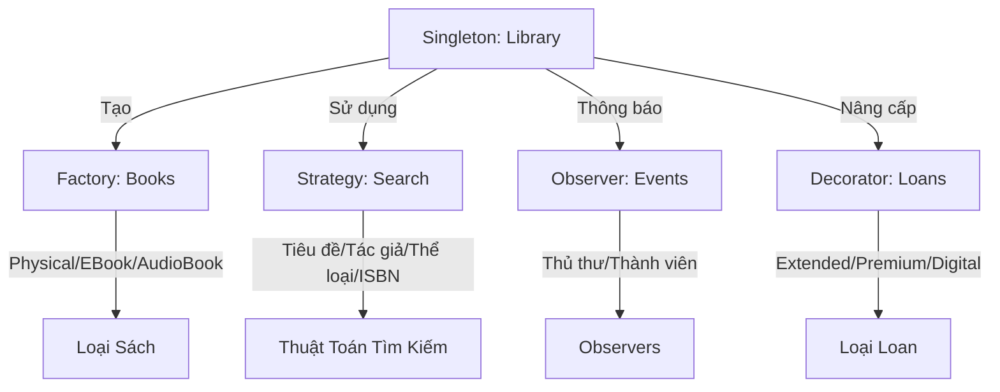

<div align="center">

# 🏗️ Kiến Trúc và Thiết Kế Hệ Thống

### Kiến Trúc Phần Mềm & Design Patterns Chuẩn Enterprise

[](https://spring.boot.io/)
[](https://nodejs.org/)
[](https://www.oracle.com/java/)
[](https://www.mongodb.com/)
[](https://redis.io/)
[](https://www.rabbitmq.com/)
[](https://www.docker.com/)

[🇬🇧 English](README.md) | [📂 Tài Liệu Lab](https://drive.google.com/drive/folders/18mLTR-UwUL_YvTdszfGPefyAqfLE3SYK) | [📖 Tài Liệu](#-tài-liệu--tham-khảo)

---

</div>

## 📖 Tổng Quan

Repository này chứa **các bài tập thực hành** cho học phần **Kiến trúc và Thiết kế Hệ thống (ASD)**, tập trung vào việc xây dựng các hệ thống phần mềm có khả năng mở rộng, dễ bảo trì và hiệu năng cao bằng cách sử dụng các patterns, nguyên tắc và best practices chuẩn công nghiệp.

### 🎯 Mục Tiêu Học Tập

<table>
<tr>
<td width="50%">

**Kiến Trúc & Thiết Kế**
- ✨ Thành thạo các Design Patterns (GoF)
- 🏛️ Triển khai nguyên tắc Clean Architecture
- 📐 Áp dụng các nguyên tắc thiết kế SOLID
- 🔄 Thiết kế kiến trúc Microservices

</td>
<td width="50%">

**Hiệu Năng & Khả Năng Mở Rộng**
- ⚡ Tối ưu hiệu năng hệ thống (cải thiện 24 lần)
- 🗄️ Tối ưu database indexing & truy vấn
- 💾 Triển khai chiến lược caching (Redis)
- 📨 Xử lý bất đồng bộ với Message Queue

</td>
</tr>
</table>

---

## 📚 Nội Dung Các Tuần

<details open>
<summary><b>Tuần 01 - Nền Tảng Microservices</b></summary>

### 🔐 Dịch Vụ Xác Thực JWT

<table>
<tr><td width="30%"><b>Công Nghệ</b></td><td>Node.js, Express.js, JWT, bcrypt</td></tr>
<tr><td><b>Khái Niệm</b></td><td>Xác thực dựa trên token, Middleware, Bảo mật</td></tr>
<tr><td><b>Tính Năng</b></td><td>
  
- Đăng ký người dùng với mã hóa mật khẩu
- Đăng nhập an toàn với JWT token
- Bảo vệ routes với auth middleware
- Cơ chế làm mới token
- Quản lý phiên làm việc

</td></tr>
</table>

### 📨 Message Queue với RabbitMQ

<table>
<tr><td width="30%"><b>Công Nghệ</b></td><td>RabbitMQ, amqplib, Docker Compose</td></tr>
<tr><td><b>Patterns</b></td><td>Work Queues, Publish/Subscribe, Topic Exchange</td></tr>
<tr><td><b>Ứng Dụng</b></td><td>
  
- Xử lý tác vụ bất đồng bộ
- Kiến trúc hướng sự kiện
- Tách rời dịch vụ
- Phân phối tải

</td></tr>
</table>

**[📁 Xem Chi Tiết Tuần 01](week01/)**

</details>

<details open>
<summary><b>Tuần 02 - Tối Ưu Hiệu Năng</b></summary>

### ⚡ Tối Ưu Hiệu Năng eCommerce

<div align="center">

| Chỉ Số | Trước | Sau | Cải Thiện |
|:------:|:------:|:-----:|:-----------:|
| **Thời Gian Phản Hồi** | 170ms | 7ms | **Nhanh hơn 24 lần** |
| **Throughput** | ~60 req/s | ~1,400 req/s | **Tăng 23 lần** |
| **Hiệu Năng** | Baseline | Đã tối ưu | **Nhanh hơn 95.9%** |

</div>

### 🛠️ Kỹ Thuật Tối Ưu

<table>
<tr>
<td width="33%" valign="top">

**Tầng Database**
- MongoDB indexing (đơn & phức hợp)
- Tối ưu truy vấn (`.lean()`)
- Connection pooling
- Field projection
- Aggregation pipeline

</td>
<td width="33%" valign="top">

**Tầng Caching**
- Triển khai Redis
- Cache-aside pattern
- Quản lý TTL (60s)
- Cache invalidation
- Theo dõi hit/miss

</td>
<td width="33%" valign="top">

**Thiết Kế API**
- `/slow` - Load all + filter
- `/fast` - Query + cache
- So sánh response
- Metrics hiệu năng
- Postman test collection

</td>
</tr>
</table>

**Tech Stack:** Node.js, Express, MongoDB, Redis, Docker, Autocannon

**[📁 Xem Chi Tiết Tuần 02](week02/ecommerce-mini/)**

</details>

<details open>
<summary><b>Tuần 03 - Triển Khai Design Patterns</b></summary>

### 🎨 7 GoF Patterns Thiết Yếu

<table>
<tr>
<td width="33%" valign="top">

**Structural Patterns**
- 🌳 **Composite**
  - Cấu trúc File System
  - Cây UI Component
- 🔌 **Adapter**
  - Chuyển đổi XML ↔ JSON
  - Tích hợp legacy system
- 🎁 **Decorator**
  - Nâng cấp Loan
  - Xếp chồng tính năng

</td>
<td width="33%" valign="top">

**Behavioral Patterns**
- 👁️ **Observer**
  - Thông báo thị trường chứng khoán
  - Sự kiện quản lý task
- 🔀 **Strategy**
  - Thuật toán tìm kiếm
  - Chuyển đổi runtime
  - Hành vi có thể thay thế

</td>
<td width="33%" valign="top">

**Creational Patterns**
- 🔒 **Singleton**
  - Library instance
  - Global access point
- 🏭 **Factory Method**
  - Tạo Book
  - Physical/EBook/AudioBook
  - Đối tượng đa hình

</td>
</tr>
</table>

### 📚 Hệ Thống Quản Lý Thư Viện

**Kiến Trúc Tích Hợp Patterns:**



### 🌐 Demo API Trực Tiếp

<table>
<tr>
<td width="50%">

**Demo Patterns**
- [`/api/composite/demo`](http://localhost:8080/api/composite/demo)
- [`/api/observer/demo`](http://localhost:8080/api/observer/demo)
- [`/api/adapter/demo`](http://localhost:8080/api/adapter/demo)

</td>
<td width="50%">

**Hệ Thống Tích Hợp**
- [`/api/library/demo`](http://localhost:8080/api/library/demo)
- Tích hợp pattern hoàn chỉnh
- Use cases thực tế

</td>
</tr>
</table>

**Tech Stack:** Spring Boot 3.2.1, Java 17, Maven, Lombok, Jackson

**[📁 Xem Chi Tiết Tuần 03](week03/ex1/)**

</details>

---

## 🛠️ Công Nghệ Sử Dụng

<table>
<tr>
<td width="50%" valign="top">

### Backend Frameworks


- **Spring Boot 3.2.1** (Java 17) - Enterprise patterns
- **Express.js 4.18** (Node.js 18+) - Microservices

### Databases & Cache


- **MongoDB 7.0** - Document database
- **Redis 7.0** - In-memory data store

### Message Broker


- **RabbitMQ 3.12** - AMQP message broker

</td>
<td width="50%" valign="top">

### DevOps & Tools


- **Docker & Docker Compose** - Containerization
- **Maven 3.6+** - Java build automation
- **npm 10+** - Node.js package manager
- **Postman** - API testing platform
- **Autocannon** - HTTP benchmarking

### Thư Viện Chính
- **jsonwebtoken** - JWT implementation
- **bcrypt** - Mã hóa mật khẩu
- **Mongoose** - MongoDB ODM
- **Lombok** - Giảm boilerplate Java
- **Jackson** - Xử lý JSON/XML
- **amqplib** - RabbitMQ client

</td>
</tr>
</table>

---

## 🚀 Bắt Đầu Nhanh

### Yêu Cầu Hệ Thống

<table>
<tr>
<td width="25%">

**Node.js**
```bash
node --version
# v18+
```

</td>
<td width="25%">

**Java**
```bash
java --version
# Java 17+
```

</td>
<td width="25%">

**Maven**
```bash
mvn --version
# Maven 3.6+
```

</td>
<td width="25%">

**Docker**
```bash
docker --version
# Docker 20+
```

</td>
</tr>
</table>

### 🔐 Tuần 01 - Microservices

<details>
<summary>Click để xem hướng dẫn cài đặt</summary>

**JWT Authentication:**
```bash
cd week01/jwt-auth
npm install
npm start
# Server chạy tại http://localhost:3000
```

**Message Queue:**
```bash
cd week01/message-queue
docker-compose up -d      # Khởi động RabbitMQ
npm install
npm run producer          # Terminal 1
npm run consumer          # Terminal 2
```

</details>

### ⚡ Tuần 02 - Tối Ưu Hiệu Năng

<details>
<summary>Click để xem hướng dẫn cài đặt</summary>

```bash
cd week02/ecommerce-mini

# Khởi động infrastructure
docker-compose up -d      # MongoDB + Redis

# Cài đặt ứng dụng
npm install
npm run seed             # Seed 10,000 sản phẩm

# Chạy server
npm start               # http://localhost:3000

# Test hiệu năng
npm run test:performance
```

**API Endpoints:**
- `GET /api/products/slow` - Chưa tối ưu (170ms)
- `GET /api/products/fast` - Đã tối ưu (7ms)
- `DELETE /api/cache/clear` - Xóa Redis cache

</details>

### 🎨 Tuần 03 - Design Patterns

<details>
<summary>Click để xem hướng dẫn cài đặt</summary>

```bash
cd week03/ex1

# Build và chạy
mvn clean install
mvn spring-boot:run

# Hoặc chạy trong IDE
# Mở DesignPatternsApplication.java
# Run as Spring Boot App
```

**Truy cập Demos:**
- 🏠 Trang chủ: http://localhost:8080
- 🌳 Composite: http://localhost:8080/api/composite/demo
- 👁️ Observer: http://localhost:8080/api/observer/demo
- 🔌 Adapter: http://localhost:8080/api/adapter/demo
- 📚 Library: http://localhost:8080/api/library/demo

</details>

---

## 📊 Cấu Trúc Project

```
asd-lab/
├── week01/
│   ├── docs/                          # Tài liệu tuần 1
│   ├── jwt-auth/                      # JWT Authentication
│   │   ├── server.js
│   │   └── package.json
│   └── message-queue/                 # RabbitMQ Demo
│       ├── src/
│       ├── docker-compose.yml
│       └── package.json
│
├── week02/
│   ├── docs/                          # Tài liệu tuần 2
│   └── ecommerce-mini/                # Tối ưu hiệu năng
│       ├── docker-compose.yml
│       ├── server.js
│       ├── config/                    # Database, Redis config
│       ├── models/                    # MongoDB models
│       ├── routes/                    # API endpoints
│       ├── middleware/                # Cache middleware
│       ├── utils/                     # Seed data
│       ├── POSTMAN-TEST.md           # Hướng dẫn testing
│       └── QUICK-START.md            # Quick start
│
├── week03/
│   ├── ex1/                           # Design Patterns
│   │   ├── pom.xml
│   │   ├── README.md
│   │   ├── GUIDE.md                  # Hướng dẫn học tập
│   │   ├── DIAGRAMS.md               # UML diagrams
│   │   └── src/main/java/io/github/iamnguyenvu/
│   │       ├── DesignPatternsApplication.java
│   │       ├── composite/            # Composite Pattern
│   │       ├── observer/             # Observer Pattern
│   │       ├── adapter/              # Adapter Pattern
│   │       ├── library/              # Library System
│   │       │   ├── singleton/
│   │       │   ├── factory/
│   │       │   ├── strategy/
│   │       │   ├── observer/
│   │       │   ├── decorator/
│   │       │   └── model/
│   │       └── controller/
│   ├── ex2/                          # Phân tích kiến trúc
│   └── ex3/                          # C4 Diagrams
│
└── README.md                         # File này
```

---

## 📚 Tài Liệu & Tham Khảo

### 📂 Tài Liệu Lab

<div align="center">

**[📥 Tải Tài Liệu Lab](https://drive.google.com/drive/folders/18mLTR-UwUL_YvTdszfGPefyAqfLE3SYK)**

*Slide bài giảng, đề bài, tài liệu tham khảo, templates & ví dụ*

</div>

### 📖 Sách Tham Khảo

<table>
<tr>
<td width="50%">

**Sách**
- 📕 *Design Patterns* - Gang of Four (GoF)
- 📗 *Clean Architecture* - Robert C. Martin
- 📘 *Microservices Patterns* - Chris Richardson
- 📙 *System Design Interview* - Alex Xu
- 📔 *Domain-Driven Design* - Eric Evans

</td>
<td width="50%">

**Tài Nguyên Online**
- 🎨 [Refactoring.Guru](https://refactoring.guru/design-patterns) - Design Patterns
- 🏗️ [Martin Fowler](https://martinfowler.com/architecture/) - Architecture
- 📐 [C4 Model](https://c4model.com/) - Architecture Diagrams
- 🔬 [Microservices.io](https://microservices.io/) - Patterns & Practices
- 🎓 [Spring Guides](https://spring.io/guides) - Spring Boot Tutorials

</td>
</tr>
</table>

---

## 🎓 Kết Quả Học Tập

Sau khi hoàn thành các lab này, bạn sẽ có thể:

<table>
<tr>
<td width="50%" valign="top">

### 🎨 Thành Thạo Design Patterns
- ✅ Triển khai 7 GoF patterns thiết yếu
- ✅ Hiểu khi nào và cách áp dụng patterns
- ✅ Nhận biết anti-patterns và code smells
- ✅ Thiết kế giải pháp dựa trên patterns
- ✅ Tích hợp nhiều patterns một cách liền mạch

### 🏗️ Kiến Trúc & Thiết Kế
- ✅ Thiết kế kiến trúc microservices
- ✅ Áp dụng nguyên tắc SOLID
- ✅ Tạo sơ đồ kiến trúc (C4, UML)
- ✅ Phân tích trade-offs kiến trúc
- ✅ Đưa ra quyết định thiết kế sáng suốt

</td>
<td width="50%" valign="top">

### ⚡ Kỹ Thuật Hiệu Năng
- ✅ Tối ưu truy vấn database với indexing
- ✅ Triển khai chiến lược caching hiệu quả
- ✅ Đo lường và cải thiện hiệu năng (nhanh hơn 24 lần)
- ✅ Xác định điểm nghẽn hiệu năng
- ✅ Áp dụng best practices tối ưu

### 🔧 Kỹ Năng Kỹ Thuật
- ✅ Xây dựng RESTful APIs với Spring Boot
- ✅ Triển khai JWT authentication
- ✅ Sử dụng message queues cho xử lý async
- ✅ Làm việc với MongoDB và Redis
- ✅ Containerize ứng dụng với Docker

</td>
</tr>
</table>

---

## 🤝 Đóng Góp

Chào mừng các đóng góp! Nếu bạn tìm thấy bugs hoặc có đề xuất:

1. 🍴 Fork repository
2. 🌿 Tạo feature branch (`git checkout -b feature/TinhNangTuyetVoi`)
3. 💾 Commit thay đổi (`git commit -m 'feat: Thêm tính năng tuyệt vời'`)
4. 📤 Push lên branch (`git push origin feature/TinhNangTuyetVoi`)
5. 🔃 Mở Pull Request

### 📝 Quy Ước Commit

Chúng tôi tuân theo [Conventional Commits](https://www.conventionalcommits.org/):

```bash
<type>(scope): <mô tả>

[nội dung tùy chọn]
[footer tùy chọn]
```

**Types:** `feat`, `fix`, `docs`, `style`, `refactor`, `perf`, `test`, `chore`

**Ví dụ:**
```bash
feat(week01): triển khai dịch vụ JWT authentication
fix(week02): sửa timeout kết nối Redis
docs(week03): thêm UML diagrams cho patterns
perf(week02): tối ưu hiệu năng truy vấn MongoDB
```

---

## 👨‍💻 Tác Giả

<table>
<tr>
<td align="center" width="150">


**Nguyễn Hoàng Nguyên Vũ**

[](https://github.com/iamnguyenvu)

MSSV: `22003185`

</td>
<td>

### 📫 Thông Tin Liên Hệ
- 🎓 **Trường:** Đại học Công Nghiệp TP.HCM
- 📚 **Học Phần:** Kiến Trúc và Thiết Kế Hệ Thống
- 📦 **Package:** `io.github.iamnguyenvu`
- 💼 **Portfolio:** [GitHub Profile](https://github.com/iamnguyenvu)

</td>
</tr>
</table>

---

## 📄 Giấy Phép

Project này được cấp phép theo **MIT License** - xem file [LICENSE](LICENSE) để biết chi tiết.

```
MIT License - Copyright (c) 2026 Nguyen Hoang Nguyen Vu
```

---

## 🙏 Lời Cảm Ơn

<table>
<tr>
<td width="50%">

**Học Thuật**
- 🎓 Giảng viên & Trợ giảng môn ASD
- 📚 Đại học Công Nghiệp TP.HCM
- 👥 Các bạn sinh viên và partners trong lab

</td>
<td width="50%">

**Tài Nguyên Kỹ Thuật**
- 📖 Gang of Four - Design Patterns
- 🌱 Cộng đồng Spring Boot & Node.js
- 🐳 Docker & containerization ecosystem
- 💻 Contributors mã nguồn mở trên toàn thế giới

</td>
</tr>
</table>

---

<div align="center">

### ⭐ Star repository này nếu bạn thấy hữu ích!


**Được tạo với ❤️ cho Học Phần Kiến Trúc và Thiết Kế Hệ Thống**

*Cập nhật lần cuối: Tháng 1/2026*

[🔝 Về Đầu Trang](#-kiến-trúc-và-thiết-kế-hệ-thống)

</div>
