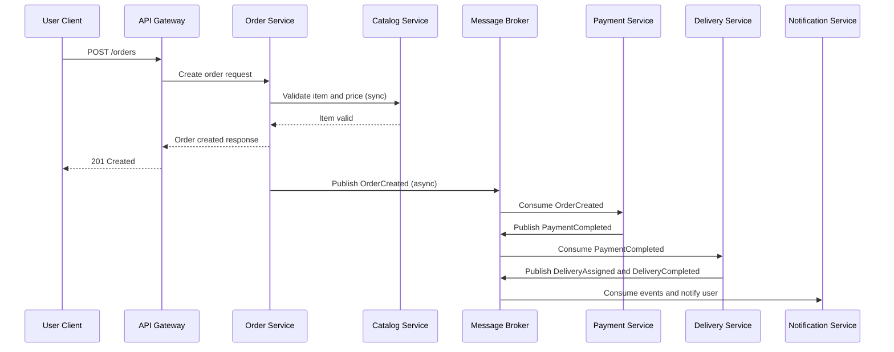

# Communication Diagram - Sync and Async

## Sync communication

Used for request-response operations requiring immediate result.

1. Client to API Gateway via HTTP REST.
2. API Gateway to Catalog Service for menu query.
3. API Gateway to Order Service for order creation.
4. Order Service to Catalog Service for item validation.

## Async communication

Used for decoupled workflows and eventual consistency.

1. Order Service publishes OrderCreated.
2. Payment Service consumes OrderCreated and publishes PaymentCompleted or PaymentFailed.
3. Delivery Service consumes PaymentCompleted and publishes DeliveryAssigned, DeliveryCompleted.
4. Notification Service consumes lifecycle events and sends notifications.

