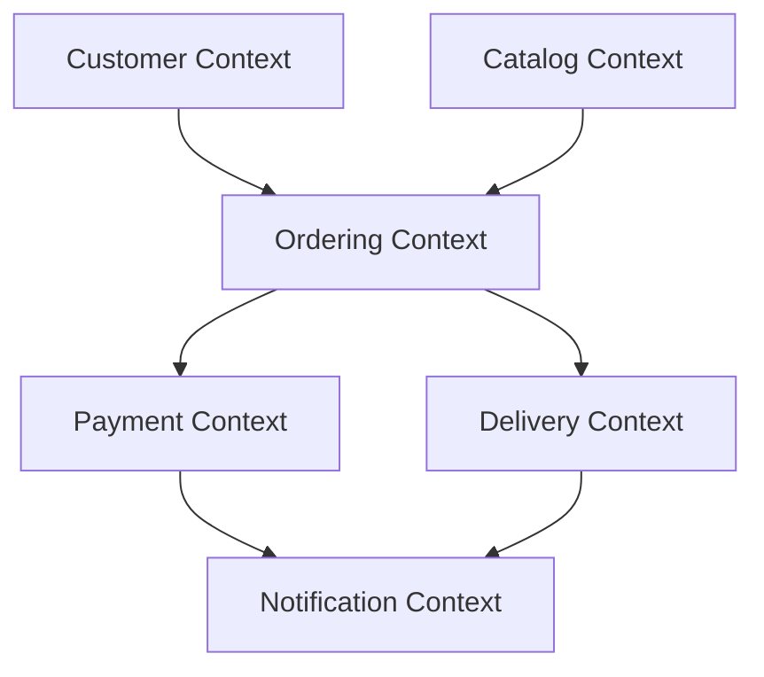

# Context Map - Bounded Contexts

## Bounded Contexts

1. Customer Context
2. Catalog Context
3. Ordering Context
4. Payment Context
5. Delivery Context
6. Notification Context

## Upstream and downstream notes

1. Catalog is upstream for Ordering when validating item data.
2. Ordering is upstream for Payment and Delivery through order lifecycle events.
3. Notification is downstream and reacts to business events from Payment and Delivery.
