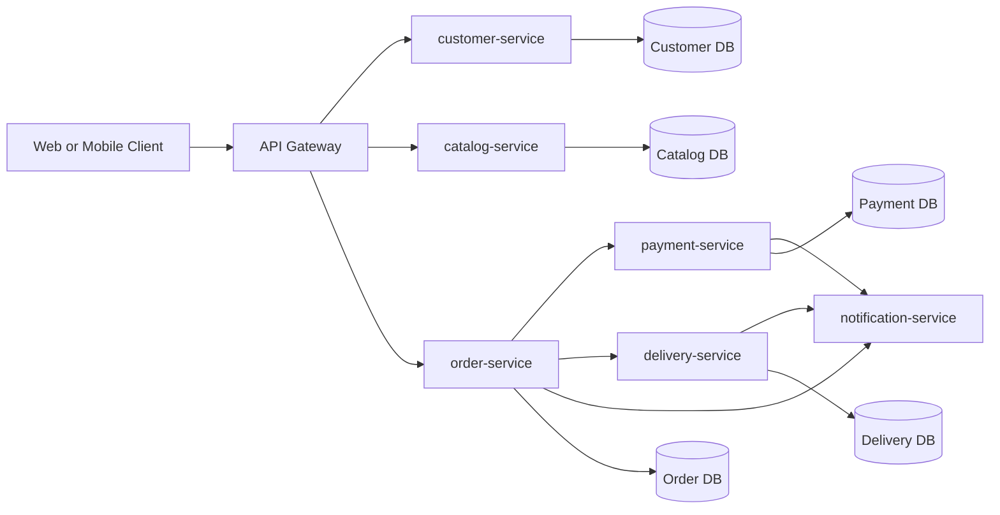
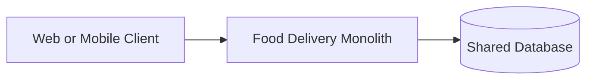

# Service Map - Online Food Delivery

## Target microservices after migration

1. api-gateway
2. customer-service
3. catalog-service
4. order-service
5. payment-service
6. delivery-service
7. notification-service

## Monolith baseline

Before migration, all capabilities are in one monolithic application with a shared database.

